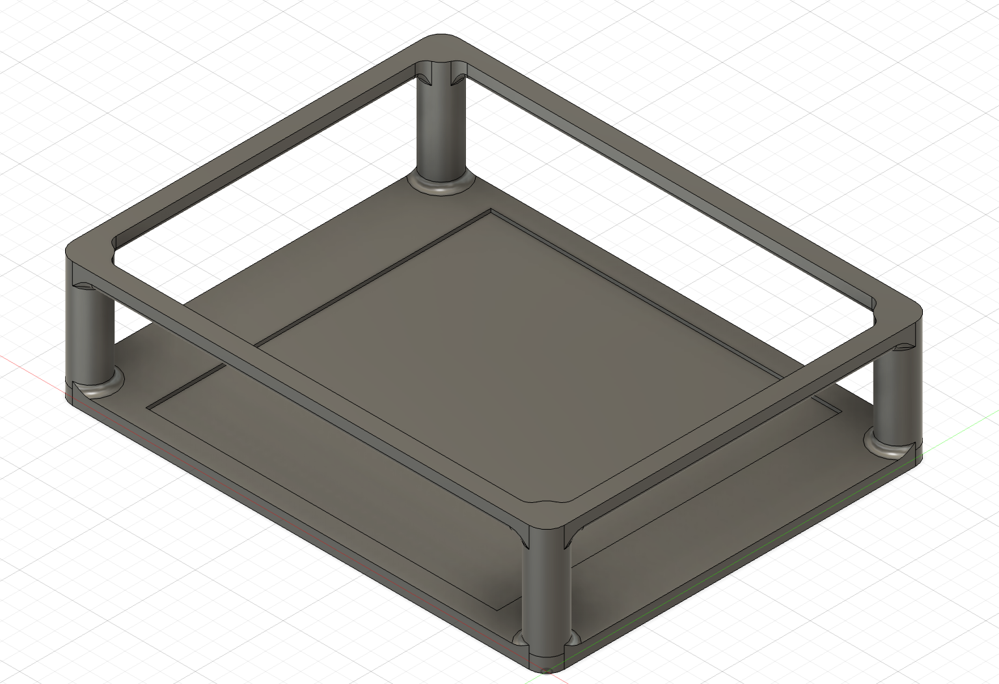

# Homelab: Kubernetes Cluster with K3s on NixOS



Lightweight, reproducible and easy-to-scale homelab K8s cluster built using [**Raspberry Pi** devices](https://www.raspberrypi.com/products/raspberry-pi-5/).

## Features

- NixOS-based: fully-reproducible, declarative and deterministic system configuration
- K3s: lightweight container orchestration using K8s
- Raspberry Pi: cost-wise setup

### Utilities

- `nginx` ingress controller
- `cert-manager` with self-signed TLS (using a generated CA for local network)
- `sops` for secrets encrypt and decrypt operations (and safely store them in repo)
- `metallb` as bare-bone K8s LoadBalancer implementation
- `pihole` as DNS manager for local network (including `external-dns` for automatic DNS registration from ingresses hosts)
- `cnpg` as main shared db cluster for all apps & services

## Getting Started

I'm currently testing the setup locally on my Macbook Air M2, using OrbStack built-in support for NixOS (see `virtualiation.nix`). To reproduce this setup in a similar way:

1. Clone the repository:
   ```bash
   git clone https://github.com/sverdejot/homelab.git
   ```
2. Change user's configuration settings with your own hashed password and SSH key
    ```bash
    mkpasswd -m sha512
    ssh-keygen -t ed25519
    ```
3. Copy the contents of the repo into `/etc/nixos`
    ```bash
    cd
    git clone git@github.com:sverdejot/homelab.git
    sudo cp homelab/* /etc/nixos
    ```
4. Rebuild the Nix configuration
    ```
    sudo nixos-rebuild switch --flake .#homelab
    ```
Now you should be able to run `sudo kubectl get pods`

## TLS

SSL is managed using a self-signed certificate issued from `cert-manager`, using a custom CA:

1. Generate your own custom CA:

```bash
# Create the CA key
openssl genrsa -out CA.key 4096

# Generate the CA cert from the key
openssl req -x509 -new -key ca.key -sha256 -days 10950 -out ca.crt
```

2. Once key and cert. are generate, encode them as a base64 string
```
cat ca.crt | base64
cat ca.key | base64
```

3. Modify the current value of `kubernetes/core/cert-manager/ca.yml` to the following:

```yaml
---
apiVersion: v1
kind: Secret
metadata:
  name: ca-certificate
  namespace: cert-manager
type: Opaque
data:
  tls.key: # your b64-encoded key
  tls.crt: # your b64-encoded cert
```

4. Now you can just apply the secret to your cluster and then encrypt it to safely push to remote repository, or you can first decrypt it and pipe the result to `kubectl apply`

## Encrypt secrets using `SOPS` and `age`

To safely push encrypted secret to remote repositories, you'll need to have [`SOPS`](https://github.com/getsops/sops) and [`age`](https://github.com/FiloSottile/age) installed

1. Generate an `age` encrypting key

```bash
age-keygen -o key
```

2. Store the key in a safe place

```bash
mkdir ~/.sops
mv key ~/.sops/key
```

3. Set the key location as an env. var

```bash
# Add the following line to your .bashrc or .zshrc
export SOPS_AGE_KEY_FILE="$HOME/.sops/key"

source .zshrc
```

Now you should be able to encrypt any secret using this key, and decrypt it on the fly before applying it to the cluster

```
# Encrypt secret in place to safely push to remote
sops --encrypt --age $(awk -F "public key: " '{print $2}' $SOPS_AGE_KEY_FILE) --encrypted-regex '^(data|stringData)$' --in-place path/to/secret.yml

# Decrypt the secret and pipe the result to kubectl
sops --decrypt --age $(awk -F "public key: " '{print $2}' $SOPS_AGE_KEY_FILE) --encrypted-regex '^(data|stringData)$' path/to/secret.yml | kubectl apply -f -
```

## Known issues

Some deployments are not fully automated (e.g. `Authentik`). Usually, secrets needs to be manually applied first and then deploy any chart/manifest that depends on them. Pending to automate all Helm-managed deployments using hooks (but in a declarative way)
