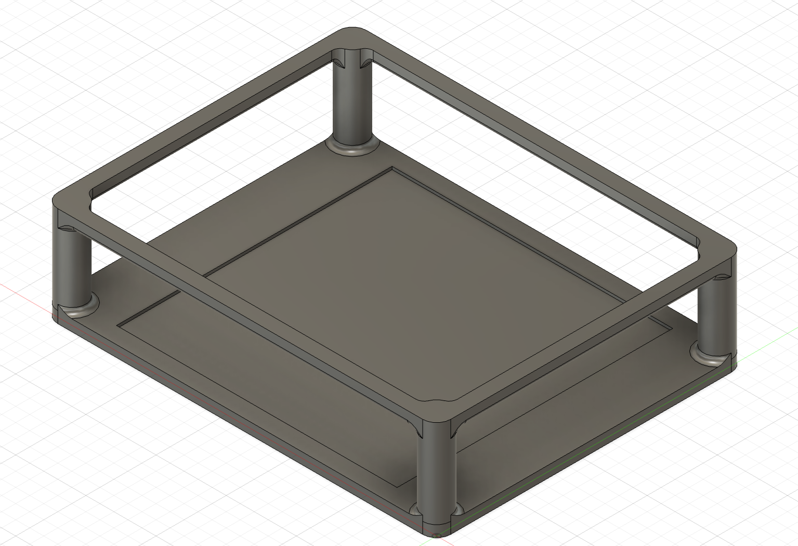

# Homelab: Kubernetes Cluster with K3s on NixOS



Lightweight, reproducible K8s cluster on **Raspberry Pi 5** devices, managed declaratively with NixOS flakes.

## Architecture

```
homelab-0 (master)  192.168.10.3   NVMe  |  k3s server + Longhorn
homelab-1 (agent)   192.168.10.4   SD    |  k3s agent
homelab-2 (agent)   192.168.10.5   SD    |  k3s agent
homelab-3 (agent)   192.168.10.6   SD    |  k3s agent
```

## Directory Structure

```
flake.nix              # Flake entrypoint
modules/
  hosts.nix            # Node topology (count, IP scheme, role definitions)
  common.nix           # Shared NixOS config (users, firewall, sops, k3s ordering)
  token.yaml           # SOPS-encrypted K3s cluster token
  age-key.txt          # Age private key for sops-nix (gitignored)
  installer.nix        # Installer SD image config (SSH key, wireless off)
  k3s/
    default.nix        # Shared k3s systemd ordering (after sops-nix)
    server.nix         # k3s server role + firewall
    agent.nix          # k3s agent role
  disko/
    sd.nix             # Disk layout for agent nodes
    nvme.nix           # Disk layout for master (boot + root + longhorn)
kubernetes/            # Helmfile-managed K8s apps (core, platform, apps)
```

## Prerequisites

- 4x Raspberry Pi 5 with NVMe HAT (master) and SD cards (agents)
- macOS or Linux builder with:
  - [Nix](https://nixos.org/download.html) with flakes enabled
  - [mise](https://mise.jdx.dev/) for task running
  - Docker (for SD image builds)

## Quick Start

### 1. Clone + generate secrets

```bash
git clone <repo-url> homelab
cd homelab

# Generate age keypair for sops-nix (keeps repo safe for public push)
age-keygen -o modules/age-key.txt
PUBKEY=$(grep 'public key' modules/age-key.txt | awk '{print $NF}')

# Update .sops.yaml with your public key
sed -i '' "s/age1.*$/age: $PUBKEY/" .sops.yaml

# Generate K3s token + encrypt
echo "k3s-token: $(openssl rand -base64 32)" > modules/token.yaml
sops --encrypt --in-place modules/token.yaml

# Generate SSH key for node access
ssh-keygen -t ed25519 -f ~/.ssh/nixos -N ''
```

### 2. Customize

Update `modules/common.nix` with your own:
- `hashedPassword` — run `mkpasswd -m sha512`
- `openssh.authorizedKeys.keys` — your SSH public key
- `system.stateVersion` — your NixOS version

Update `.sops.yaml` with your existing age key for `kubernetes/.*` secrets if different.

### 3. Flash SD cards

```bash
mise run flash:master 0 /dev/disk2    # Installer SD for master
mise run flash:agent 1 /dev/disk3     # Agent 1
mise run flash:agent 2 /dev/disk4     # Agent 2
mise run flash:agent 3 /dev/disk5     # Agent 3
```

All nodes boot from SD. The master's installer image is used to flash NVMe via `nixos-anywhere`.

### 4. Install master to NVMe

Boot the master node from its SD card, then:

```bash
mise run install:master
```

This partitions the NVMe, installs NixOS, and reboots into the NVMe system with sops-nix decrypting the K3s token automatically.

### 5. Boot agents

Insert agent SD cards and power on. Each agent joins the cluster at `192.168.10.3:6443`.

### 6. Deploy K8s services

```bash
mise run k8s:sync core        # MetalLB, cert-manager, nginx, longhorn
mise run k8s:sync platform    # ArgoCD, linkerd, grafana, prometheus, authentik
mise run k8s:sync apps        # gitea, n8n, umami, pihole, registry, ...
```

## Mise Tasks

| Task | Description |
|------|-------------|
| `flash:master <n> <device>` | Build and flash installer SD image for master |
| `flash:agent <n> <device>` | Build and flash SD image for agent `n` |
| `install:master` | Install master to NVMe via nixos-anywhere |
| `deploy:key <n>` | Copy age key to running node `n` (for nixos-rebuild) |
| `k8s:diff <layer>` | Helmfile diff for core/platform/apps |
| `k8s:sync <layer>` | Helmfile sync for core/platform/apps |
| `k8s:lint` | YAML lint all K8s manifests |

## Secrets

- **K3s token**: encrypted at `modules/token.yaml` via SOPS + age. Decrypted at boot by sops-nix.
- **Age key**: `modules/age-key.txt` (gitignored). Read via flake path input, deployed by activation script.
- **K8s secrets**: SOPS-encrypted in `kubernetes/`. Decrypted on-the-fly with `sops --decrypt | kubectl apply`.

Repo safe for public push: private keys never appear in tracked files.

## Binary Cache

`nixos-raspberrypi.cachix.org` configured in `flake.nix`. Kernel, firmware, and vendor packages downloaded as binaries — no 4hr compiles.

## Scaling

Edit `modules/hosts.nix`:

```nix
{
  nodeCount = 6;    # was 4
  baseIP = "192.168.10";
  ipOffset = 3;
  # master.agent definitions stay the same
}
```

Rebuild + reflash agent SDs.
